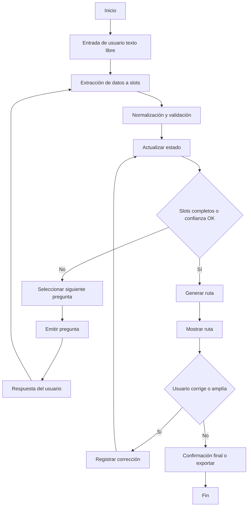

# Diagrama de Flujo de IA

```mermaid
flowchart TD
    A[Inicio] --> B[Entrada de usuario texto libre]
    B --> C[Extracción de datos a slots]
    C --> D[Normalización y validación]
    D --> E[Actualizar estado]
    E --> F{Slots completos o confianza OK}
    F -->|No| G[Seleccionar siguiente pregunta]
    G --> H[Emitir pregunta]
    H --> I[Respuesta del usuario]
    I --> C
    F -->|Sí| J[Generar ruta]
    J --> K[Mostrar ruta]
    K --> L{Usuario corrige o amplía}
    L -->|Sí| M[Registrar corrección]
    M --> E
    L -->|No| N[Confirmación final o exportar]
    N --> O[Fin]
```
